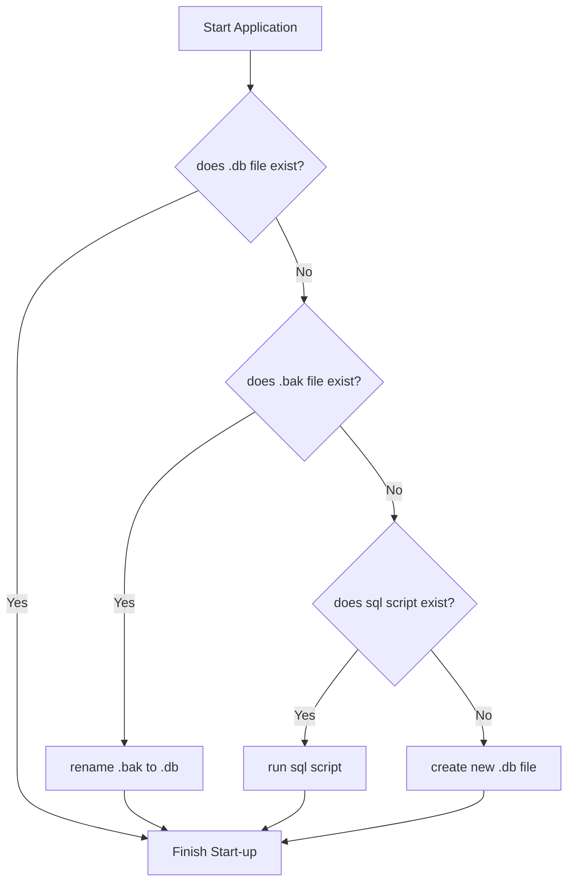

# Node API Documentation

## Maven Setup

Because we don't have admin privileges on our Mac's the following must be run in order to run a global install with `npm`.

```bash
mkdir "${HOME}/.npm-packages"
npm config set prefix "${HOME}/.npm-packages"
NPM_PACKAGES="${HOME}/.npm-packages"
export PATH="$PATH:$NPM_PACKAGES/bin"
# Preserve MANPATH if you already defined it somewhere in your config.
# Otherwise, fall back to `manpath` so we can inherit from `/etc/manpath`.
export MANPATH="${MANPATH-$(manpath)}:$NPM_PACKAGES/share/man"
source ~/.zshrc
```

## Project Setup

To create a  Node API project you can use yeoman and execute the following commands:

```bash
npm install -g yo
npm install -g generator-napi-module
yo napi-module
```

## Files and Folders

The following files and folders are important to know about:

### `binding.gyp`

This is configuration for the `node-gyp` library which is responsible for compiling your C++ code. You shouldn't have to touch this file.

```python
{
  'targets': [
    {
      'target_name': 'hello-world-native',
      'sources': [ 'src/hello_world.cc' ],
      'include_dirs': ["<!@(node -p \"require('node-addon-api').include\")"],
      'dependencies': ["<!(node -p \"require('node-addon-api').gyp\")"],
      'cflags!': [ '-fno-exceptions' ],
      'cflags_cc!': [ '-fno-exceptions' ],
      'xcode_settings': {
        'GCC_ENABLE_CPP_EXCEPTIONS': 'YES',
        'CLANG_CXX_LIBRARY': 'libc++',
        'MACOSX_DEPLOYMENT_TARGET': '10.7'
      },
      'msvs_settings': {
        'VCCLCompilerTool': { 'ExceptionHandling': 1 },
      }
    }
  ]
}
```

### `src/`

This folder is for your C++ source files. Here is an example file that defines two functions.

```cpp
#include <napi.h>
#include <iostream>

using namespace Napi;

String HelloWorld(const CallbackInfo& info) {
  
  std::cout << "Hello from C++!" << std::endl; // Log statement to prove C++ is being executed

  std::string word = info[0].As<String>(); // Parse first arg as string

  return String::New(info.Env(), word + "World!"); // Return first arg + "World!"
}

Value AddInt(const CallbackInfo& info) {

  int x = info[0].As<Number>().Int32Value(); // Parse first arg as int
  int y = info[1].As<Number>().Int32Value(); // Parse second arg as int
  
  int sum = x + y; // add both ints

  return Number::New(info.Env(), sum); // return sum
}

Object Init(Env env, Object exports) {
  
  exports.Set(String::New(env, "HelloWorld"), Function::New(env, HelloWorld)); // Export HelloWorld method as "HelloWorld"

  exports.Set(String::New(env, "AddInt"), Function::New(env, AddInt)); // Export AddInt method as "AddInt"

  return exports;
}

NODE_API_MODULE(addon, Init)
```

### `lib/binding.js`

This defines the bindings or mappings between your C++ functions and JavaScript functions. This file will need to be updated as you add more functions to your C++ code. Here is what this file might look like.

```javascript
const addon = require('../build/Release/hello-world-native');

module.exports = {
    HelloWorld: addon.HelloWorld, // Export HelloWorld as JavaScript function
    AddInt: addon.AddInt // Export AddInt as JavaScript function
}
```

### `index.js`

Your main JavaScript file. This can be called whatever you want, but here is an example using the Node API.

```javascript
const {HelloWorld, AddInt} = require("./lib/binding.js");

console.log(HelloWorld("Hello ")) // Call the C++ function HelloWorld from JavaScript function of the same name

console.log("1 + 2 =", AddInt(1, 2)) // Call the C++ function AddInt from JavaScript function of the same name
```

## Compiling and Running

To compile your C++ code you must run `npm install`. After that you can use node to run `index.js`.

## Sources

- https://nodejs.github.io/node-addon-examples/getting-started/first/

- https://gyp.gsrc.io/docs/UserDocumentation.md

- https://github.com/nodejs/node-addon-examples/blob/main/src/1-getting-started/2_function_arguments/node-addon-api/addon.cc
